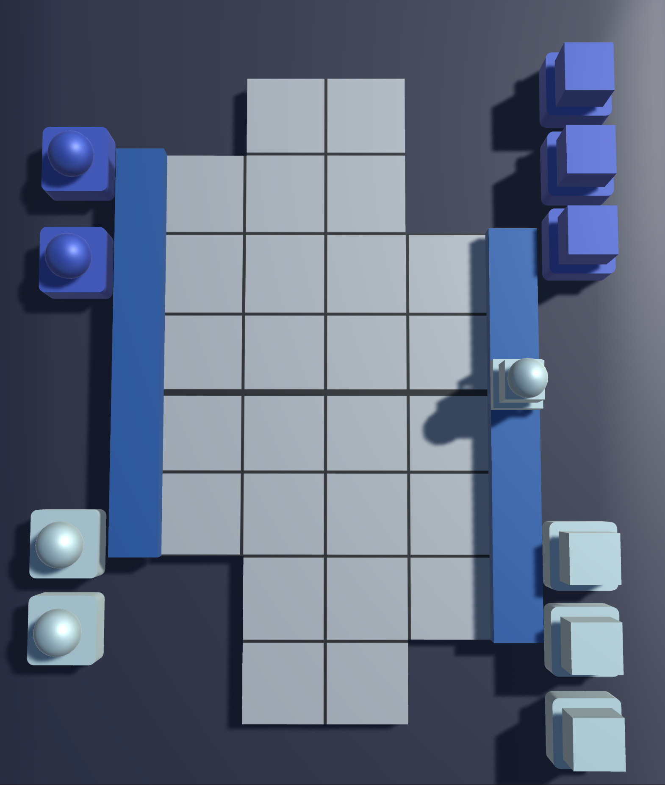
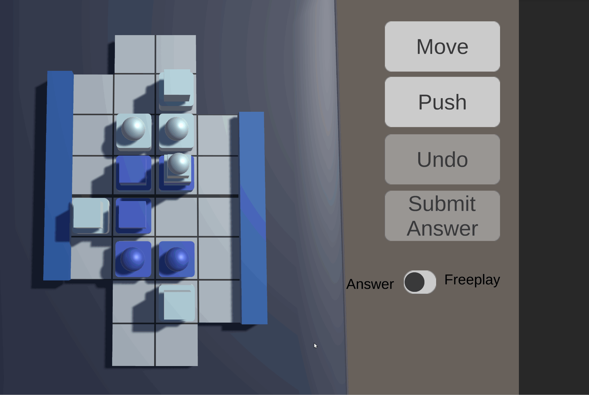
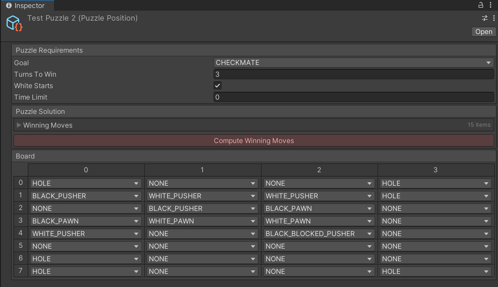

*The features shown below are part of the [Detective Project](https://github.com/jspro123/Demo-Detective-All), which is currently under development. As such, the demo's code/assets will remain private.*
*I am not affiliated with Brett Picotte or Push Fight; this was merely a hobby project I worked on in my spare time.*
***

## What is Push Fight?

Push Fight is an abstract board game for two players designed by Brett Picotte, supposedly to teach his students Jiu-Jitsu.

- The goal of the game is to push any of the opponent's pieces of the board.
- The board is 8x4; there are, however, six holes (three on each long side) where pieces may also be pushed off.
- A turn consists of up-to two moves, and a push. A push moves an entire line of connected pieces, horizontally or vertically, exactly one space. If a piece is pushed either off the board or into a hole, the game immediately ends. 
- Only the square pieces can push.
- When a push is made, an anchor is placed on top of the pushing piece. The anchored piece cannot be pushed at all, even indirectly. 

For a more detailed look at the game, I invite you to visit the [creator's website](https://pushfightgame.com)

## Connection To Detective Project

The design of the detective game requires puzzles that the player can encounter "in the field". I needed a puzzle or mini-game to test my implementation; I chose Push Fight simply because I had already implemented it (November 2021). The player can now start a puzzle, attempt solving it, and return to the main game.

# Features

- Player vs. Player, Player vs. Computer.
	- Options for computer include move depth and branching factor. Primitive minimax.
    
	- Tweened animations when pieces are moved. 
    
	- An undo button to reset your turn.
- Puzzles.
	- Find the winning move! Puzzles that challenge you to search up-to three full moves ahead.
    
	- Winning moves are precomputed using an optimized BitBoard minimax implementation to find all "correct" moves.
	- Freeplay mode lets you experiment and play both sides.